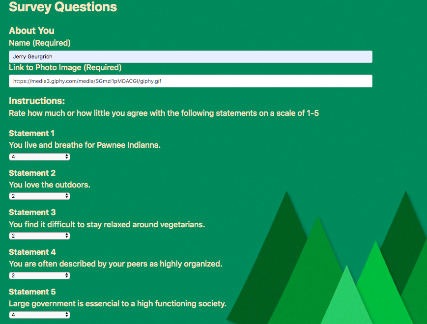
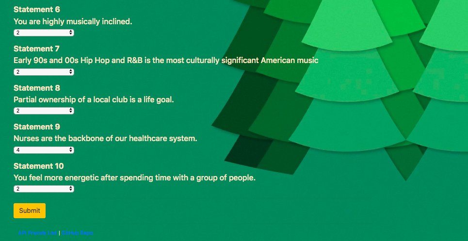

# Friend Finder - Node and Express Servers

<br>

## Description

Friend Finder is a compatibility-based  application -- basically a dating app. This full-stack site takes results from users' surveys, then compares their answers with those from other users. The app will then display the name and picture of the user with the best overall match.


<br>

## Overview of App Organization

This is app contains the following files:

  ```
  FriendFinder
    - .gitignore
    - app
      - data
        - friends.js
      - public
        - home.html
        - survey.html
      - routing
        - apiRoutes.js
        - htmlRoutes.js
    - node_modules
    - package.json
    - server.js
  ```
  
* The survey asks 10 questions of chosen to maximize compatibility. Each answer is on a scale of 1 to 5 based on how much the user agrees or disagrees with a question.

The `htmlRoutes.js` file contains:

   * A GET Route to `/survey` which displays the survey page.
   * A default, catch-all route that leads to `home.html` which displays the home page.

* The `apiRoutes.js` file contains:

   * A GET route with the url `/api/friends` to display a JSON of all possible friends.
   * A POST routes `/api/friends` to handle incoming survey results. 
   * This route also handles the compatibility logic.

* The application's data is stored inside of `app/data/friends.js` as an array of objects. Each of these objects roughly follow the format below.

```json
{
  "name":"Ahmed",
  "photo":"https://media.licdn.com/mpr/mpr/shrinknp_400_400/p/6/005/064/1bd/3435aa3.jpg",
  "scores":[
      5,
      1,
      4,
      4,
      5,
      1,
      2,
      5,
      4,
      1
    ]
}
```

* This information determines current user's most compatible friend
  * This is displayed as a modal pop-up with the name and picture of the closest match.


<br>

## Run Instructions

The user begins at:


Then after the **Find Friend!** button, they are instructucted to begin filling out the questionaire.



Once the survey is filled out, click the **Submit** button



The best match will pop up as below!


## This App Utilizes

   * [Express](https://www.npmjs.com/package/express)

   * [Path](https://www.npmjs.com/package/path)


<br>

## Role in Development

My name is Alex I am a bootcamp student whose portfolio can be found
[here.]( https://alexsamalot19.github.io/Samalot-Alexander-Portfolio/)

I designed this app using existing APIs and packages listed in the **This App Utilizes** section. I used Express to handle routing. The site is deployed to Heroku [here.](https://friendfinder987.herokuapp.com/).